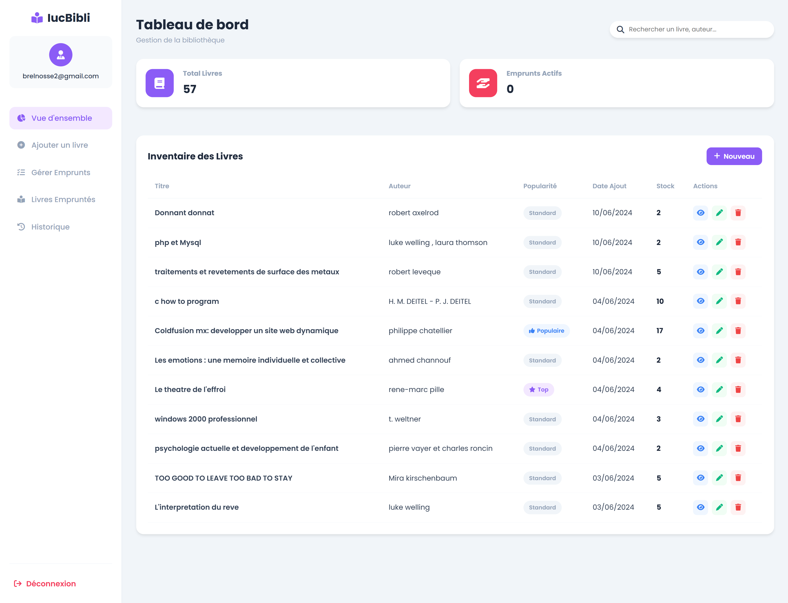

# 📚 iucBiBli - Gestion de Bibliothèque

Application web de gestion des emprunts de livres (réservations, retours, pénalités) développée en PHP natif.

## 📸 Aperçu
| Espace Étudiant (Accueil) | Espace Admin (Dashboard) |
|:---:|:---:|
|  |  |
| *Recherche et réservation de livres* | *Statistiques et gestion des retours* |

## 🛠️ Stack Technique
* **Backend** : PHP 8 (PDO), MySQL.
* **Frontend** : HTML5, CSS3, JavaScript, Chart.js (Statistiques).
* **Outils** : Architecture MVC, UML (Conception).

## 🚀 Installation & Test Rapide

### 1. Prérequis
* Serveur local (Laragon, XAMPP, ou WAMP).
* Base de données MySQL.

### 2. Installation
1.  **Cloner le repo** dans votre dossier `www` ou `htdocs`.
2.  **Base de données** :
    * Créez une BDD nommée `iucbibli`.
    * Importez le fichier `database.sql` (situé à la racine).
3.  **Configuration** :
    * Vérifiez les identifiants dans `config.php` (par défaut : user `root`, sans mot de passe).

### 3. Comment Tester (Scénarios)

#### 👤 **Test Étudiant (Emprunteur)**
1.  Allez sur la page d'accueil et cliquez sur **"S'inscrire"**.
2.  Remplissez le formulaire (Matricule (IUCXXEXXXXXXX) 13 chiffres, École, Niveau, etc.).
3.  Une fois connecté :
    * Recherchez un livre et ajoutez-le au panier.
    * Validez une demande d'emprunt.

#### 🔐 **Test Bibliothécaire (Admin)**
1.  Sur l'accueil, cliquez sur **"Se connecter en tant qu'administrateur"**.
2.  Utilisez le code d'accès suivant : **[email: jfk19736@gmail.com, matricule: IUC23E0081654]**.
3.  Fonctionnalités à tester :
    * **Dashboard** : Visualisez les stats (graphe des livres populaires).
    * **Gestion** : Validez les demandes d'emprunt en attente.

---
*Projet réalisé dans le cadre du cursus Ingénieur - IUC Douala.*
